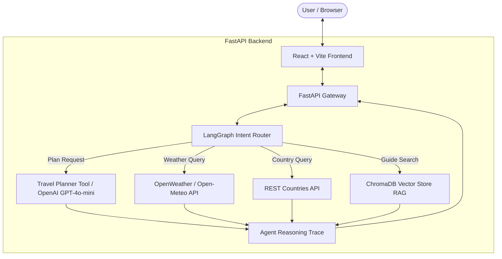

# ✈️ AI Travel Planner Agent

An end-to-end, production-grade **AI Travel Planner Agent** combining **Generative AI**, **Agentic AI (LangGraph)**, **Retrieval-Augmented Generation (RAG)** via **ChromaDB**, live external APIs (**OpenWeather** and **REST Countries**), and a modern **React (Vite) + Tailwind CSS** glassmorphic frontend.

Designed specifically to showcase modern AI application engineering for technical demonstrations, university coursework, and a high-impact GitHub portfolio.

---

## 🌟 Key Features

1. **AI Travel Planner**:
   - Generates day-wise itineraries with timeline visual cards.
   - Interactive budget allocation breakdown (Accommodation, Dining, Transit, Activities).
   - Local attraction highlights, regional food suggestions, travel tips, and best seasons to visit.

2. **Agentic AI Workflow (LangGraph)**:
   - Automatic intent classification and dynamic tool routing.
   - Real-time **Agent Activity Panel** visualizing reasoning steps (`✓ Query Received`, `✓ Intent Classified`, `✓ Weather API Executed`, `✓ RAG Search Completed`, `✓ Response Generated`).

3. **Document-Based RAG (ChromaDB)**:
   - Upload travel guides in `.pdf` or `.txt` format.
   - Semantic text chunking and vector storage.
   - Intelligent retrieval with document citation badges when responding to user queries.

4. **Live Travel Telemetry**:
   - Real-time weather reporting (temperature, condition, humidity, wind speed).
   - Detailed country stats (capital, currency, population, languages, timezones, national flag).

5. **AI Chat Assistant**:
   - Conversational assistant with session history to answer follow-up questions regarding packing, culture, safety, and transit.

---

## 🏗️ Architecture Diagram



---

## 🛠️ Technology Stack

- **Frontend**: React 18, Vite, Tailwind CSS v3, Axios, Lucide Icons, React Router DOM v6
- **Backend**: Python 3.10+, FastAPI, Uvicorn, Pydantic v2, Python-Dotenv
- **AI & Agentic Framework**: OpenAI GPT-4o-mini, LangChain, LangGraph
- **RAG & Vector Store**: ChromaDB, OpenAI Embeddings, PyPDF, LangChain Text Splitters
- **External Telemetry APIs**: OpenWeather API, REST Countries API

---

## 📂 Project Directory Structure

```
ai-travel-planner-agent/
├── backend/
│   ├── app.py                   # FastAPI Application Entrypoint & CORS configuration
│   ├── requirements.txt         # Backend Python Dependencies
│   ├── .env                     # Environment Variables (API Keys)
│   ├── .env.example             # Template Environment File
│   ├── config/
│   │   └── settings.py          # App Configuration & Settings Loader
│   ├── models/
│   │   └── schemas.py           # Pydantic Request & Response Data Schemas
│   ├── routes/
│   │   ├── planner.py           # Itinerary Generation Route
│   │   ├── chat.py              # Agent Chat Route
│   │   ├── rag.py               # Document Ingestion & RAG Upload Routes
│   │   └── destination.py       # Weather & Country Telemetry Route
│   ├── agents/
│   │   ├── router.py            # Intent Classification Logic
│   │   └── graph_agent.py       # LangGraph Execution & Step Tracing Processor
│   ├── tools/
│   │   └── planner_tool.py      # OpenAI Structured Itinerary Synthesizer
│   ├── rag/
│   │   ├── loader.py            # Document Parser & Chunking Engine
│   │   ├── store.py             # ChromaDB / Vector Store Engine
│   │   └── retriever.py         # Semantic Search & Context Extractor
│   └── services/
│       ├── weather_service.py   # OpenWeather & Open-Meteo Integrations
│       └── country_service.py   # REST Countries API Integration
└── frontend/
    ├── package.json             # Frontend Dependencies & Scripts
    ├── vite.config.js           # Vite Configuration
    ├── tailwind.config.js       # Tailwind CSS Configuration
    ├── index.html               # HTML Shell
    └── src/
        ├── App.jsx              # Main App Router & Layout Shell
        ├── main.jsx             # React DOM Mounting Entrypoint
        ├── index.css            # Custom CSS & Glassmorphism Utilities
        ├── services/
        │   └── api.js           # Axios Backend API Interface
        ├── components/
        │   ├── Navbar.jsx               # Header & Navigation Bar
        │   ├── AgentActivityPanel.jsx   # Real-Time Reasoning Step Trace
        │   ├── ItineraryTimeline.jsx    # Day-wise Cards & Timeline
        │   ├── BudgetCard.jsx           # Cost Allocation Breakdown
        │   ├── WeatherCard.jsx          # Live Weather Metric Dashboard
        │   ├── CountryCard.jsx          # Country Metadata Card
        │   ├── ChatWindow.jsx           # Conversational AI Assistant
        │   └── FileUpload.jsx           # RAG Document Manager
        └── pages/
            ├── Home.jsx                 # Hero & Feature Showcase Page
            ├── TravelPlanner.jsx        # Itinerary Form & Results View
            ├── ChatPage.jsx             # Conversational Assistant Page
            ├── DocumentRAG.jsx          # RAG Ingestion & Vector Search Page
            └── DestinationInfo.jsx      # Telemetry Search Page
```

---

## ⚡ Quick Start & Setup Instructions

### Prerequisites
- **Python 3.10+**
- **Node.js 18+** & `npm`

---

### 1. Backend Setup

```bash
# Navigate to backend directory
cd backend

# Create a virtual environment (optional but recommended)
python -m venv venv
# On Windows:
venv\Scripts\activate
# On macOS/Linux:
source venv/bin/activate

# Install dependencies
pip install -r requirements.txt

# Configure Environment Variables
# Create or edit .env file inside backend/ directory:
OPENAI_API_KEY=sk-proj-... # Your OpenAI API Key
OPENWEATHER_API_KEY=       # Optional (Fallback to Open-Meteo if left blank)
MODEL_NAME=gpt-4o-mini
HOST=0.0.0.0
PORT=8000

# Start the FastAPI server
python app.py
```

FastAPI server will run live at: `http://localhost:8000` (API Docs available at `http://localhost:8000/docs`).

---

### 2. Frontend Setup

```bash
# Open a new terminal and navigate to frontend directory
cd frontend

# Install npm dependencies
npm install

# Start Vite dev server
npm run dev
```

Frontend application will launch at: `http://localhost:5173`.

---

## 🧪 Verification & Demonstration Walkthrough

1. **Travel Planner**: Open `http://localhost:5173/planner`, enter a destination like `Tokyo, Japan`, set budget to `$1500`, select 4 days, and click **Generate Itinerary**. Watch the **Agent Activity Panel** log execution steps in real time!
2. **AI Chat Assistant**: Open `/chat` and ask travel follow-up questions such as *"What should I pack for Tokyo in October?"*.
3. **RAG Search**: Open `/documents`, upload a sample travel guide (`.pdf` or `.txt`), and search for specific guide information. Notice the **RAG Knowledge Match** badge and source document citation.
4. **Live Telemetry**: Open `/destination` and search for any country or city to view real-time weather and metadata.

---

## 🚀 Future Enhancements

- Multi-modal image generation for target attractions.
- Live flight & hotel booking affiliate widget integrations.
- Export itinerary as PDF or calendar `.ics` file.

---

## 📜 License

Distributed under the MIT License. Free for educational and personal portfolio use.

---

## 👨‍💻 Author

Developed for advanced agentic AI portfolio demonstration.
